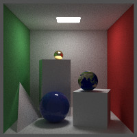

# SimpleRayTracer

## 参考链接
[https://github.com/RayTracing/raytracing.github.io](https://github.com/RayTracing/raytracing.github.io)

## 运行环境
- Windows 10
- Visual Studio 2019

## 主要实现
- 求交：Sphere, Rectangle, Triangle
- 材质：Diffuse, Lambertian, Metal, Dielectric, Isotropic
- 碰撞：AABB

## 效果展示

